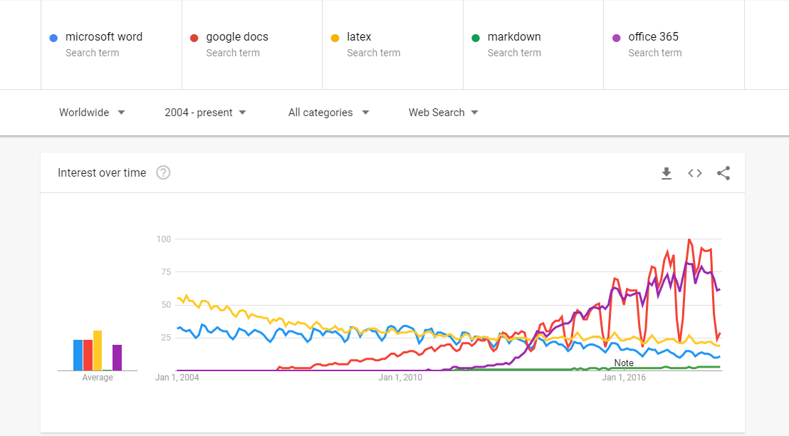
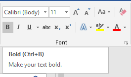
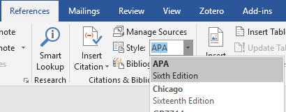
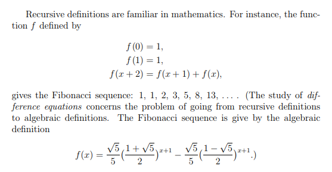
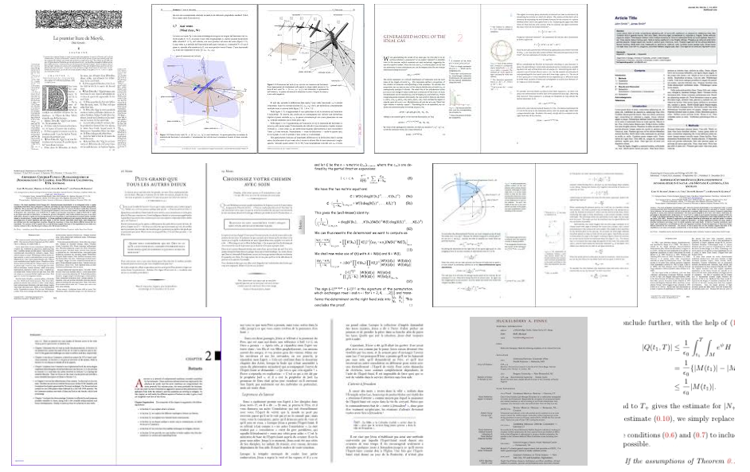

# Contents

${toc}

# Introduction

Academic writing systems are an important part of the research ecosystem. Every researcher must choose a writing system to use when authoring their scholarly work, and the number of tools to choose from is very large. How should users decide amongst the various academic writing systems available to them? How should they evaluate and compare prospective systems with each other? How might these systems be grouped in order to better facilitate generalized comparisons?

This paper provides by way of example an introductory treatment of these questions. It suggests two broad classifications of writing systems, and samples and reviews two representative systems from each classification. It suggests a number of measures upon which these systems can be evaluated, evaluates the sample systems against these measures, and compares their evaluations. It then makes some effort to generalizes these findings to their classifications, and suggests opportunities for future improvements to the academic writing system ecosystem.

# Literature Review

Unfortunately, relatively little prior research on academic writing systems has been published in the literature. What research there is on academic writing generally appears to focus on the social and linguistic aspects of academic writing, and less on the technology used to facilitate the writing and publishing process.

One notable exception is the Voegler et. al. study of Markdown for use in transcribing accessible study materials specifically for use of students with disabilities. [^markdown] They find that using Markdown results in improved quality and accessibility of study materials. This suggests that, on the spectrum between What You See Is What You Get (WYSIWYG) editors on the one hand, and highly technical markup languages like pure HTML or LaTeX on the other, Markdown -- which falls somewhere in the middle -- strikes a good balance between the consistency and accessibility offered by markup languages, and the ease of use offered by WYSIWYG editors. The implication is that further investigation into and design of academic writing systems should prioritize simple markup langugaes like Markdown.

# Methodology

Each system in this review is evaluated on a number of measures. For simplicity, each measure is scored on a binary (P)ass/(F)ail scale.

| Measure | Pass Criteria | 
|-|-|
| Cost | Free |
| Source Code Licensing | Open Source |
| Availability | Commonly pre-installed or free on the web |
| Operating system support | Supports Windows, Mac OS, and Linux |
| Ease of Installation | Reviewer judgement |
| Ease of Use | Reviewer judgement |
| Consistency of Style | Reviewer judgement |
| Separation of Content and Style | Full separation |
| Print Document Support | Supports print document output |
| Web Document Support | Supports web document output |
| Bibliography Support | Supports automated bibliography formatting |

An overall grade for each system is then assigned as the ratio of the count of passing measures to the total number of measures, which happens to be eleven.

# Review

For the purposes of this review, only modern, currently relevant systems are considered; legacy systems are out of scope.

This review considers two broad categories of academic writing systems -- word processing systems and typesetting and markup systems. Two example systems are sampled and reviewed from each category. The heirarchy of systems reviewed herein is:

- Academic Writing systems
  - Word processing systems
    - Microsoft Word
    - Google Docs
  - Typesetting and markup systems
    - LaTeX
    - Markdown

## Word processing systems

Word processors are likely the most widely used writing systems -- they are certainly the most searched about. Google Docs, for example, commands a high proportion of search volume among popular writing systems:

  
*Search trends among writing systems. Google Trends.*

Word processers tend to be highly available, easy to use, and have wide operating system support. On the downside, they tend to more closely couple content and styling, making it more difficult to maintain consistent formatting. This is a direct result of their WYSIWYG user interface model, where users are encouraged to directly edit the styling of indivdid

This review samples Microsoft Word and Google Docs as writing systems from the word processing category.

### Microsoft Word

Microsoft Word is probably the single most popular academic writing system in use today; it is an integral part of the Microsoft Office suite, which is widely available on PCs around the world. It scores well on ease of use, availability, and most functional measures, but poorly on cost, licensing, and styling. It is best suited for less technical users who wish to author documents where cost and separation of content and style are not pressing concerns.

As of 2018, Microsoft Word is available both as an installable application, and as a software-as-a-service subscription as part of Office 365. Both products will be considered as one for the purposes of this review.

Microsoft Word passes six out of our eleven evaluation metrics:

| Measure | Passes? | 
|-|-|
| Cost | Fail |
| Source Code Licensing | Fail |
| Availability | Pass |
| Operating system support | Pass |
| Ease of Installation | Pass |
| Ease of Use | Pass |
| Consistency of Style | Fail |
| Separation of Content and Style | Fail |
| Print Document Support | Pass |
| Web Document Support | Fail |
| Bibliography Support | Pass |
| **Total** | **6/11** |

**Cost: Fail**

Microsoft Office is proprietary software. It is available at a variety of price points. As of this writing, personal use licenses are available directly from Microsoft at Office.com on a subscription basis for as little as $8 per month, or for a one-time fee of $169.[[office-pricing]](#office-pricing)

**Source Code Licensing: Fail**

As proprietary software, Microsoft Office's source code is not available under an open source license.

**Availability: Pass**

Although it comes at a cost, Microsoft Office is widely installed on Windows and Mac computers at educational institutions, workplaces, libraries, and homes.

**Operating system support: Pass**

With the launch of Office 365, and its availability any modern web browser, Microsoft Word can run on any operating system.

**Ease of Installation: Pass**

Word is accessible via Office 365 in any modern web browser, so there is no installation required.

**Ease of Use: Pass**

Word's ubiquity means that most academic authors are relatively experienced with it. This familiarity translates into a relatively high level of usability. In addition, its WYSIWYG interface is also highly familiar and accessible, further cementing it as an easy to use academic writing tool.

**Consistency of Style: Fail**

Consistency of style is a functional dimension on which Word is relatively weak. While Word does support decoupled styling, its WYSIWYG interface makes it extremely easy to apply styles inconsistently. Many users become accustomed to manually styling individual content elements, rather than using more abstract styling tools like headers or templates. The prominence of Word's affordances for inline styling encourage this kind of inconsistency.

  
*Microsoft Word's prominent inline styling controls*

**Separation of Content and Style: Fail**

Word's ability to perform inline styling allows for tight coupling of content and style.

**Print Document Support: Pass**

Word's default editing and output formats are the standard 8.5" by 11" letter print format.

**Web Document Support: Pass**

Office 365 natively supports online document sharing. The desktop version supports exporting to various online platforms, as well as to static html documents.

**Bibliography Support: Pass**

Word has solid automated bibliography formatting support.

  
*Word's bibliography controls*

### Google Docs

Google Docs is the primary competitor to Word in the word processing market. It is very similar to Microsoft Word, with the exception that it scores better on cost, but worse on bibliography support.

Google Docs passes 7 out of our 11 evaluation metrics:

| Measure | Passes? | 
|-|-|
| Cost | Pass |
| Source Code Licensing | Fail |
| Availability | Pass |
| Operating system support | Pass |
| Ease of Installation | Pass |
| Ease of Use | Pass |
| Consistency of Style | Fail |
| Separation of Content and Style | Fail |
| Print Document Support | Pass |
| Web Document Support | Pass |
| Bibliography Support | Fail |
| **Total** | **7/11** |

**Cost: Pass**

Personal use of Google Docs is available online for free. Paid subscriptions are also available for institutions that have more complex requirements.

**Source Code Licensing: Fail**

Google Docs is proprietary software, and as such, its source code is not available.

**Availability: Pass**

Google Docs is ubiquitously available as an online service, accessible via any modern web browser.

**Operating system support: Pass**

Like Word via Office 365, Google Docs can run on any operating system via a web browser.

**Ease of Installation: Pass**

No installation is required to use Google Docs online.

**Ease of Use: Pass**

Like Word, Docs is a WYSIWYG editor. As such, it is similarly easy to use.

**Consistency of Style: Fail**

Again, like Word, Docs WYSIWYG interface makes it too easy for users to apply styles inconsistently.

**Separation of Content and Style: Fail**

Like Microsoft Word and most other WYSIWYG word processors, Google Docs makes it relatively easy for users to tightly couple content and style. Although Docs supports clean separation of content from styles, the lack of strict enforcement makes it relatively easy for users to use inline styles.

**Print Document Support: Pass**

Like Microsoft Word, Google Docs' default editing and output formats are also the standard 8.5" by 11" letter print format.

**Web Document Support: Pass**

As an online only product, Google Docs has native web document support. 

**Bibliography Support: Fail**

Unlike Word, Docs does not support automated bibliography formatting or management. Users must manage and format their citations manually.

## Typesetting and markup systems

Typesetting and markup systems like LaTeX and Markdown sacrifice the WYSIWYG interface and its corresponding ease of use in exchange for a cleaner separation of style and content. These systems often require the use of additional tools such as plain text editors, integrated development environments, and terminal emulators. They also tend to be free software.

To the extent possible, this review takes an agnostic approach to the additional tools required by these systems -- nuances are only addressed if absolutely necessary.

We review LaTeX and Markdown as representatives of the typesetting and markup systems category.

### LaTeX

LaTeX is a popular academic writing language and toolset. It is relatively commonly utilized in quantitative academic disciplines like mathematics, statistics, and computer science. It is licensed as free software.[[latex-license]](#latex-license)

LaTeX passes 9 out of our 11 evaluation metrics:

| Measure | Passes | 
|-|-|
| Cost | Pass |
| Source Code Licensing | Pass |
| Availability | Pass |
| Operating system support | Pass |
| Ease of Installation | Pass |
| Ease of Use | Fail |
| Consistency of Style | Pass |
| Separation of Content and Style | Pass |
| Print Document Support | Pass |
| Web Document Support | Fail |
| Bibliography Support | Pass |
| **Total** | **9/11** |

LaTeX scores well on measures of cost, accessibility, and styling, but relatively poorly on ease of use. It also has good bibliography and print document support, but has relatively weak web document support.

  
*Example LaTeX output*

**Cost: Pass**
**Source Code Licensing: Pass**

LaTeX is licensed under the LaTeX Project Public License -- a free software license developed specifically for the LaTeX project. There are a number of free LaTeX distributions available for various operating systems. [^latex-distributions] Free online variants are also available.

**Availability: Pass**
**Operating system support: Pass**
**Ease of Installation: Pass**

Free online versions make LaTeX universally accessible to users of any system with a modern web browser with no installation required.

Installation of desktop versions have varying installation difficulty, depending on the version.

**Ease of Use: Fail**

Markup languages are generally significantly more difficult to use than word processing systems -- LaTeX is no exception. Instead of simply pointing and clicking or using keyboard shortcuts to make formatting changes, users must reference or memorize and recall specific markup syntax. Once memorized, these methods are efficient; however, significant practice is required to develop the expertise required to be proficient.

**Consistency of Style: Pass**
**Separation of Content and Style: Pass**

Markup languages generally stand out at their ability to consistently apply and separate style from content, and LaTeX is no exception. Users first choose (or create) a LaTeX template. Once a template is selected, markup is rendered in the style as defined by the template. This ensures that content and style are clearly separated, and that styling is consistently applied across the document.

**Print Document Support: Pass**

LaTeX excels at typesetting printed documents. It is traditionally and most commonly used to typeset academic articles and texts in printed formats.

  
*Google Image Search results for "latex showcase". Every example is a print document.*

**Web Document Support: Fail**

Web-based LaTeX distributions do provide for some level of web document support for LaTeX; however, these distributions still tend to assume print document output. True web document support, with responsive, accessible output, is not well supported by the LaTeX ecosystem.

**Bibliography Support: Pass**

LaTeX has excellent automated bibliography formatting support via BibTeX. [^bibtex] BibTeX alows users to specify citations in a standardized format that can then be transformed into any desired citation style. Although technically a separate tool, BibTeX often comes bundled with LaTeX distributions, making it seamless to use.

Here is an example BibTeX bibliography entry:

```latex
@misc{ Nobody06,
       author = "Nobody Jr",
       title = "My Article",
       year = "2006" }
```

This entry would be cited in the article like so:

```latex
According to Nobody Jr ~\cite{Nobody06} ...
```

Depending on the citation style applied to this document, the output would look something like the following:

> According to Nobody Jr [1] ...
>
> References
>
> 1. My Article. Nobody Jr, 2006.

### Markdown

Markdown is a relatively new markup language that acts as both an extension to and simplification of HTML. It is designed to be readable by both humans and machines, and to have a syntax resembling that of well formatted plain-text documents. For the purposes of this review, we consider Markdown as defined by the GitHub Flavored Markdown (GFM) specification. [^gfm]

Markdown passes 9 out of our 11 evaluation metrics:

| Measure | Passes? | 
|-|-|
| Cost | Pass |
| Source Code Licensing | Pass |
| Availability | Pass |
| Operating system support | Pass |
| Ease of Installation | Pass |
| Ease of Use | Pass |
| Consistency of Style | Pass |
| Separation of Content and Style | Pass |
| Print Document Support | Fail |
| Web Document Support | Pass |
| Bibliography Support | Fail |
| **Total** | **9/11** |

**Cost: Pass**
**Source Code Licensing: Pass**
**Availability: Pass**

Markdown specifications and implementations in general tend to be freely available on the web under open source licenses. GFM, in particular, is licensed under a Creative Commons license. [^cc] GitHub also provides free git repository hosting that automatically renders Markdown files, as well as free static site hosting for custom themed Markdown documents and sites. [^github-pages]

**Operating system support: Pass**

GitHub's online Markdown editor and free hosting make Markdown available on any operating system that supports modern web browsers. Many similar alternatives also exist.

**Ease of Installation: Pass**

The wide availability of online Markdown editors means that no installation is required for its use.

Installing Markdown locally can be somewhat more difficult. Markdown renderers are generally command line tools, and users who are not comfortable with these tools may find their installation somewhat difficult. 

**Ease of Use: Pass**

Unlike LaTeX -- and most markup languages generally  -- Markdown syntax is relatively simple and intuitive. This simplicity comes at the expensive of a number of advanced features that LaTeX supports that Markdown does not; however, for many -- if not most -- projects, LaTeX's advanced features add unnecessary complexity to the academic writing workflow.

**Consistency of Style: Pass**
**Separation of Content and Style: Pass**

As a markup language, Markdown makes it relatively simple to separate style from content, as well as to apply styles consistently throughout a document. Because it extends and is rendered to HTML, Markdown achieves this by using Cascading Stylesheets (CSS) to apply styles.

**Print Document Support: Fail**

As a web native technology, Markdown has relatively poor print document support. Although CSS supports print-friendly formats, most Markdown renderers and styles default to web formats, and tend to neglect print document support.

**Web Document Support: Pass**

On the other hand, Markdown has excellent web document support. It is primarily designed to render into HTML -- the quintessential web format.

**Bibliography Support: Fail**

Unlike LaTeX, Markdown does have a de facto toolset for bibliography management. While various [^academic-markdown-citations] implementations [^citations-scholarly-markdown] of citation management for Markdown exist, little consensus has been reached in the community around their use. This presents both a significant challenge and an opportunity for improvement of the Markdown ecosystem.

# Discussion

## Measure Analysis

According to our measures, markup systems perform slightly better than word processing systems overall. This differential is largely explained by the fact that markup systems tend to be open source, and enable consistent, decoupled document styling.

| Measure | Microsoft Word | Google Docs | LaTeX | Markdown |
|-|-|-|-|-|
| System Type | Word Processing | Word Processing | Typesetting and Markup | Typesetting and Markup |
| Cost | Fail | Pass | Pass | Pass |
| Source code licensing | Fail | Fail | Pass | Pass |
| Availability | Pass | Pass | Pass | Pass |
| Operating system support | Pass | Pass | Pass | Pass |
| Ease of installation | Pass | Pass | Pass | Pass |
| Ease of use | Pass | Pass | Fail | Pass |
| Consistency of style | Fail | Fail | Pass | Pass |
| Separation of content and style | Fail | Fail | Pass | Pass |
| Print document support | Pass | Pass | Pass | Fail |
| Web document support | Fail | Pass | Fail | Pass |
| Bibliography support | Pass | Fail | Pass | Fail |
| **Total** | **6/11** | **7/11** | **9/11** | **9/11** |

What is the relative importance of these measures? What criteria might we use to determine their relative importance? A simple heuristic for determining the relative importance of measures is by assigning a higher importance to measures that have a lower entropy among the sample.[^shannon] By this measure, we can partially order the relative importance of these measures in the following way:

1. Measures with four passes or four fails.
2. Measures with one pass and three fails, or three fails and one pass.
3. Measures with two passes and two fails

By this criteria, we have the following partial ordering of importance of our measures:

1. Measures with four passes or four fails:
  - Measures with four passes:
    - Availability
    - Operating system support
    - Ease of installation
2. Measures with one pass and three fails, or three fails and one pass:
  - Measures with three passes and one fail:
    - Cost
    - Ease of use
    - Print document support
3. Measures with two passes and two fails
  - Source code licensing
  - Consistency of style
  - Separation of content and style
  - Web document support
  - Bibliography support

Because ranks two and three of this criteria are pass-biased, this analysis permits an interpretation of these ranks as relatively core requirements of academic writing systems -- most, if not all, of the systems assessed meet them. Rank one, on the other hand, can be viewed as relatively optional.

An interesting observation of this ranking is that the optional requirements tend to be more functional and feature-like in nature, while the core requirements tend to be focused more on accessibility.

Overall, typesetting and markup systems tended to outperform on optional requirements.

## Properties of an Ideal Academic Writing System

With these results in mind, what might an ideal academic writing system look like? We would likely look for an open source, cross platform typesetting and markup system that is easy to use and install, with simple, built-in bibliography support. It would likely need to be somewhat simpler and easier to use and than LaTeX, with improved web document support, while maintaining its strong bibliography and print document support.

A logical starting point would be to leverage the relative simplicity of Markdown, while adding better bibliography and print document support.

# Conclusion

## Summary

This review assessed the current state of the literature on academic writing systems, proposed a set of criteria for evaluating and comparing academic writing systems, and performed an evaluation and comparison of four popular academic writing systems: two word processing systems; Microsoft Word and Google Docs; and two typesetting and markup systems; LaTeX and Markdown. Overall, typesetting and markup systems tended to outperform word processing systems due to their open source licensing and better styling support.

Two broad subsets of evaluation criteria were identified using an information theoretic approach: core critiria, and optional criteria. Core criteria were present in at least 75% of the sampled systems, while optional criteria were present in only 50% of the sampled systems.

## Limitations

One limitation of this review is that LaTeX and Markdown are somewhat ambiguously defined systems. Markdown itself is most strictly defined as a markup language and not a system. Even under this strict interpretation, significant ambiguity remains. Which particular "flavour" or specification of Markdown is intended? Which LaTeX engine is intended?

The approach of this study was to use MiKTeX[^miktex] and Pandoc[^pandoc] as representative implementations of LaTeX and Markdown systems, respectively.

Another limitation of this study is that it makes no attempt to estimate or measure user perspectives on the given systems, measures, or measure ranking criteria -- the authors judgement is taken as the sole authority on the matter.

## Future Direction

Two broad directions exist for further investigation into academic writing systems: user experience research into these systems, and further development of systems that improve user experiences.

A specific opportunity for further user experience research into academic writing systems is a survey academic authors regarding their experiences and preferences on academic writing systems. Such a survey would provide valuable information to designers and developers of academic writing systems.

Significant opportunities exist for further development of academic writing systems that specifically improve upon those measures identified by this study as optional requirements, as it is these requirements that were least often met by the systems under review. In particular, since these optional requirements tend to be functional in nature, a further focus on the functional subset of these requirements may be warranted, i.e. on improved style, bibliography, and web support.

# References

